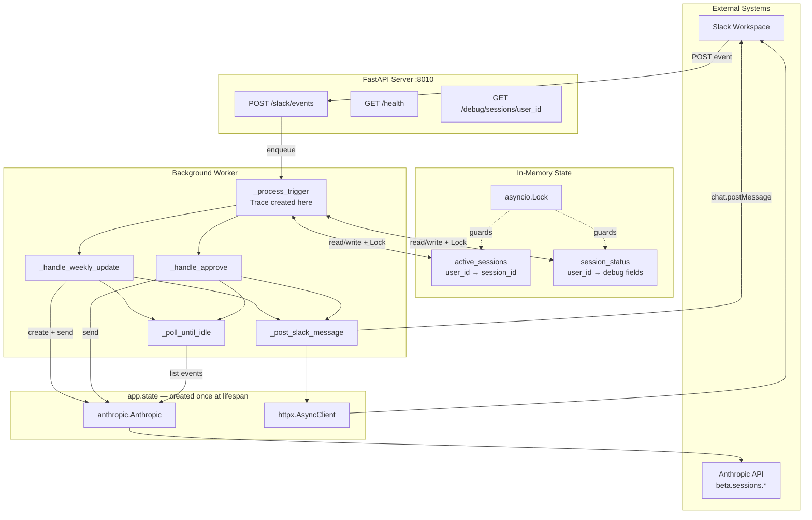
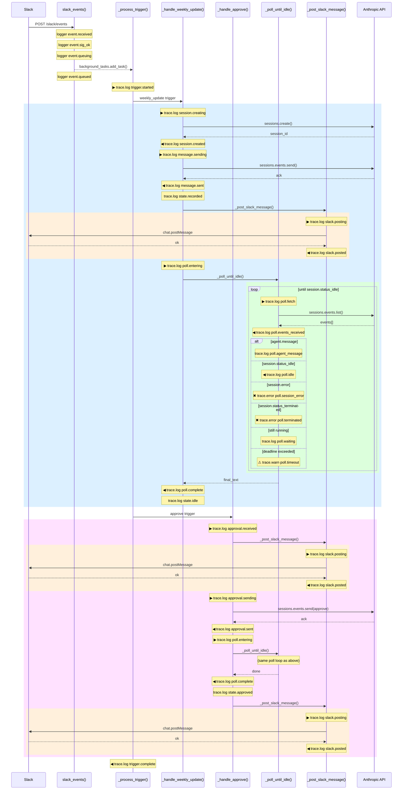

# System Architecture — Managed Agent Slack Events Server

## Overview

A FastAPI server that bridges Slack Events API with Anthropic Managed Agent sessions.
Inbound Slack messages trigger background jobs that create or resume sessions, poll
for completion, and post results back to Slack. A `Trace` object is created per job
and carried through every function to produce correlated, timed log lines.

---

## Components

| Component | Role |
|-----------|------|
| `slack_events()` | FastAPI route — verifies signature, classifies trigger, enqueues background task |
| `_process_trigger()` | Background task entry point — creates `Trace`, dispatches to handler |
| `_handle_weekly_update()` | Creates session, sends message, drives poll loop |
| `_handle_approve()` | Resumes a paused session, drives poll loop |
| `_poll_until_idle()` | Polls `sessions.events.list` until `session.status_idle` |
| `_post_slack_message()` | Async HTTP post to `chat.postMessage` via shared `httpx.AsyncClient` |
| `Trace` | Dataclass — carries `user_id`, `trigger`, `session_id`, `perf_counter` start |
| `Settings` | Pydantic-settings — validates all env config once at startup |
| `app.state.anthropic` | Singleton `anthropic.Anthropic` client (created in `lifespan`) |
| `app.state.http` | Shared `httpx.AsyncClient` for Slack HTTP (created in `lifespan`) |
| `active_sessions` | `dict[user_id → session_id]`, protected by `asyncio.Lock` |

---

## Component Diagram



---

## Trace Instrumentation — Function Boundaries

Every `trace.log/warn/error()` call emits:
```
stage=<label>  user=<id>  trigger=<name>  session=<id>  elapsed_ms=<n>  [extra fields]
```

The diagram below shows exactly where `Trace` is called at each function boundary.
`▶` = entry point of hand-off, `◀` = return / completion. `⚠` = warn, `✖` = error.



---

## Trace Stage Reference

| Stage | Level | Function | Description |
|-------|-------|----------|-------------|
| `trigger.started` | info | `_process_trigger` | Background job begins |
| `trigger.complete` | info | `_process_trigger` | Job finished cleanly |
| `trigger.timeout` | warn | `_process_trigger` | Deadline exceeded |
| `trigger.failed` | error | `_process_trigger` | Unhandled RuntimeError |
| `session.creating` | info | `_handle_weekly_update` | About to call `sessions.create` |
| `session.created` | info | `_handle_weekly_update` | `session_id` returned |
| `message.sending` | info | `_handle_weekly_update` | About to call `sessions.events.send` |
| `message.sent` | info | `_handle_weekly_update` | Message accepted by Anthropic |
| `state.recorded` | info | `_handle_weekly_update` | `active_sessions` / `session_status` updated |
| `poll.entering` | info | `_handle_weekly_update`, `_handle_approve` | Hand-off to poll loop |
| `poll.complete` | info | `_handle_weekly_update`, `_handle_approve` | Poll loop returned |
| `state.idle` | info | `_handle_weekly_update` | Session marked idle in state |
| `approval.no_active_session` | warn | `_handle_approve` | Approve with no known session |
| `approval.received` | info | `_handle_approve` | Approve trigger accepted |
| `approval.sending` | info | `_handle_approve` | About to send approval message |
| `approval.sent` | info | `_handle_approve` | Approval accepted by Anthropic |
| `state.approved` | info | `_handle_approve` | Session marked approved in state |
| `poll.fetch` | info | `_poll_until_idle` | About to call `sessions.events.list` |
| `poll.events_received` | info | `_poll_until_idle` | Event list returned (with types) |
| `poll.agent_message` | info | `_poll_until_idle` | `agent.message` event observed |
| `poll.idle` | info | `_poll_until_idle` | `session.status_idle` received |
| `poll.waiting` | info | `_poll_until_idle` | Sleeping until next poll |
| `poll.timeout` | warn | `_poll_until_idle` | Deadline exceeded inside loop |
| `poll.session_error` | error | `_poll_until_idle` | `session.error` event received |
| `poll.terminated` | error | `_poll_until_idle` | `session.status_terminated` received |
| `slack.posting` | info | `_post_slack_message` | About to call `chat.postMessage` |
| `slack.posted` | info | `_post_slack_message` | Slack confirmed delivery |
| `slack.skip` | warn | `_post_slack_message` | `SLACK_BOT_TOKEN` not set |
