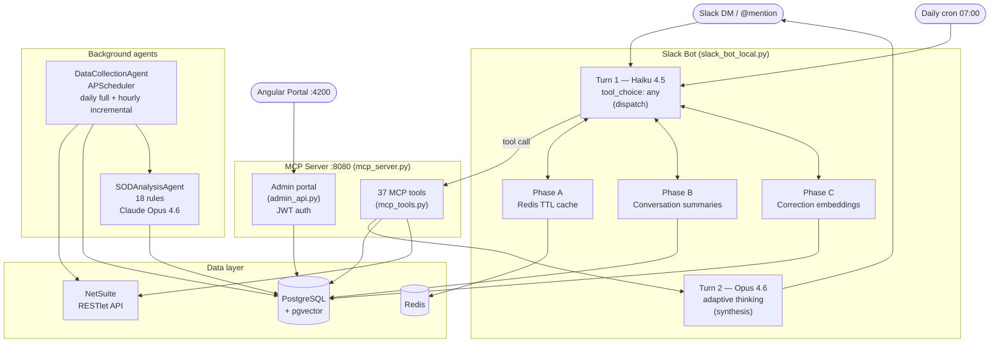

# SOD Compliance Agent — Technical Design

## Overview

A multi-agent SOD compliance system deployed as an MCP server. It monitors NetSuite user
access, detects Segregation of Duties violations against 18 SOD rules, and surfaces
findings via Slack with an Angular admin portal for configuration.

| File | Purpose |
|------|---------|
| `mcp/mcp_server.py` | FastAPI MCP server — 37 tools + admin portal routes |
| `mcp/admin_api.py` | JWT-authenticated admin portal backend (16 endpoints) |
| `mcp/mcp_tools.py` | Tool schemas and async handlers |
| `slack_bot_local.py` | Slack Socket Mode bot — Haiku dispatch + Opus synthesis |
| `agents/analyzer.py` | SOD rule engine — 18 rules, Claude Opus 4.6 |
| `agents/data_collector.py` | Background sync — daily full + hourly incremental from NetSuite |
| `utils/semantic_router.py` | Embedding-based tool pre-filter (MiniLM-L6-v2) |
| `utils/tool_router.py` | Keyword regex router (fallback) |
| `services/correction_service.py` | Phase C — correction embedding store + retrieval |
| `angular-portal/` | Angular 17 admin UI |

---

## Architecture



### Agent roles

| Component | Model | Tools | Role |
|-----------|-------|-------|------|
| Haiku dispatch | claude-haiku-4-5 | 37 MCP tools (pre-filtered by semantic router) | Picks the right tool; never answers directly |
| Opus synthesis | claude-opus-4-6 | none (reads tool results) | Reasons over tool output; writes Slack response |
| SODAnalysisAgent | claude-opus-4-6 | none | Evaluates 18 SOD rules against user role combinations; assigns risk scores |
| DataCollectionAgent | n/a | NetSuite RESTlet | Syncs users, roles, permissions to PostgreSQL on schedule |

---

## Component details

### Two-turn LLM pipeline

Every Slack query goes through a fixed two-turn pipeline:

```python
# Turn 1 — Haiku (dispatch, cheap + fast)
response = anthropic.messages.create(
    model="claude-haiku-4-5",
    tool_choice={"type": "any"},   # REQUIRED — forces a tool call
    tools=semantic_select_tools(user_message, MCP_TOOLS),
    messages=[{"role": "user", "content": user_message}]
)

# Turn 2 — Opus (synthesis, deep reasoning)
final = anthropic.messages.create(
    model="claude-opus-4-6",
    thinking={"type": "adaptive"},
    stream=True,
    messages=[user_turn, haiku_turn, tool_result_turn]
)
```

`tool_choice: {"type": "any"}` on Turn 1 is required — without it Haiku answers
directly from weights rather than calling a tool.

### Semantic tool router

`utils/semantic_router.py` pre-filters the 37-tool list to the top-K most relevant
tools before sending them to Haiku. This prevents the context window from being
polluted with irrelevant schemas and keeps MRR high.

```python
from utils.semantic_router import semantic_select_tools
relevant_tools = semantic_select_tools(user_message, MCP_TOOLS, top_k=10)
```

Model: `sentence-transformers/all-MiniLM-L6-v2` (local, 384-dim, no API key).
Each tool has curated example queries in `TOOL_EXEMPLARS` that are embedded at
startup and compared against the user message at query time via cosine similarity.

**Eval results:**

| Metric | Keyword router | Semantic router |
|--------|---------------|-----------------|
| Hit Rate@10 | 0.72 | 1.00 |
| MRR | 0.18 | 0.91 |
| NDCG@10 | 0.37 | 0.89 |

### Memory pipeline (Phases A–C)

| Phase | Mechanism | What it does |
|-------|-----------|-------------|
| A | Redis TTL cache | Caches MCP tool results (30min–24h by tool). Cache key: `mcp:{tool}:{md5(args)}`. Mutating tools excluded. |
| B | PostgreSQL summaries | Haiku writes a 2-3 sentence summary after each DM exchange. Top-3 summaries injected as prior context (~150 tokens vs ~2K raw). |
| C | pgvector corrections | On ❌ feedback, correction embedded (MiniLM 384-dim) and stored. Top-3 similar past corrections injected as few-shot context on future queries. |

### Admin portal auth

`mcp/admin_api.py` issues JWTs via `POST /auth/login`. Authority level is derived
from the user's NetSuite role at login time:

```python
_ROLE_LEVEL_MAP = {
    "CFO": 5, "VP Finance": 4, "Controller": 4,
    "Revenue Manager": 4, "Director": 3,
}
```

JWTs are stored in-memory only in the Angular frontend (no localStorage — XSS-safe).
Tokens expire after `JWT_EXPIRE_HOURS` (default 8h).

At runtime, `mcp_server.py` mounts both routers:
```python
app.include_router(auth_router)    # /auth/*
app.include_router(admin_router)   # /admin/*
```

---

## Deployment

```bash
# Start MCP server (port 8080)
./scripts/restart_mcp.sh

# Start Slack bot (foreground)
python3 slack_bot_local.py

# Start Angular portal (dev, port 4200)
cd angular-portal && ng serve

# Refresh shared gateway after MCP server restart
curl -s -X POST http://localhost:8090/tools/refresh
```

### CI/CD

GitHub Actions at `.github/workflows/ci.yml`:
- **Lint** (`ruff check .`) — runs on every push/PR
- **Test** (`pytest tests/`) — Postgres 16 + pgvector + Redis service containers

Tests requiring live external APIs are excluded (NetSuite, Anthropic, running MCP server).

---

## Environment variables

| Variable | Used by |
|----------|---------|
| `ANTHROPIC_API_KEY` | Haiku dispatch, Opus synthesis, SOD analyzer |
| `DATABASE_URL` | All agents, MCP tools, admin portal |
| `REDIS_URL` | Phase A cache, Celery broker |
| `NETSUITE_ACCOUNT_ID` | NetSuite OAuth 1.0a |
| `NETSUITE_CONSUMER_KEY` | NetSuite OAuth 1.0a |
| `NETSUITE_CONSUMER_SECRET` | NetSuite OAuth 1.0a |
| `NETSUITE_TOKEN_KEY` | NetSuite OAuth 1.0a |
| `NETSUITE_TOKEN_SECRET` | NetSuite OAuth 1.0a |
| `NETSUITE_RESTLET_URL` | DataCollectionAgent |
| `SLACK_BOT_TOKEN` | Slack WebClient |
| `SLACK_APP_TOKEN` | Slack Socket Mode |
| `JWT_SECRET` | Admin portal JWT signing |
| `ADMIN_PORTAL_PASSWORD` | Admin portal login |
| `LANGSMITH_API_KEY` | Distributed tracing + eval suite |
| `LANGCHAIN_TRACING_V2` | LangSmith auto-tracing |
| `MCP_API_KEY` | MCP server X-API-Key auth |
| `MCP_ALLOWED_ORIGINS` | CORS allowed origins (default: localhost, localhost:4200) |

See `.env.example` for full list with defaults.

---

## Known limitations

- **NetSuite page size cap** — RESTlet silently truncates at 200 users/request regardless
  of the `page_size` parameter. Always use `page_size=200`. Passing 1000 loses 79.2% of data.
- **`INSUFFICIENT_KNOWLEDGE` routing** — not applicable here; the Slack bot uses a fixed
  two-turn pipeline rather than a router agent, so model drift cannot break tool dispatch.
  However, if Haiku ignores `tool_choice: any` (e.g. due to a model update), it will answer
  from weights without calling any tool.
- **Read-only Jira writes** — `updater.py` raises `ReadOnlyError` unconditionally. All sprint
  replanning is dry-run only until the trust criteria in the product doc are met.
- **Single-tenant identity lock** — `client.py` verifies `JIRA_EMAIL` matches
  `prabal.saha@fivetran.com` at startup. Multi-tenant auth is required before onboarding
  a second team.
- **Angular portal Phase 1 only** — Dashboard, Violations, Exceptions, SOD Rules, and
  Thresholds screens are live. Audit Trail, Token Analytics, and credential rotation
  (Phases 2–4) are not yet implemented.
- **Google Sheets export stub** — `export_report` with `format=gsheets` returns
  `"⚠️ Google Sheets export not yet implemented"`. Requires `gspread` + service account setup.
